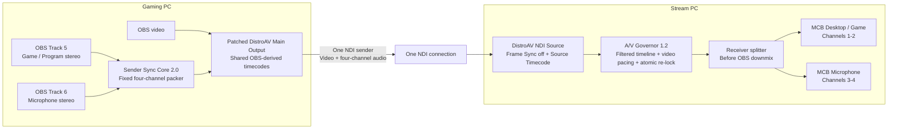

# Multichannel Bridge for DistroAV

> Experimental modified DistroAV build for two-PC OBS setups
> Current version: **0.5.0-alpha1**
> Based on: **DistroAV 6.2.1**

## Personal project and support disclaimer

Hi — I’m a YouTuber, not a professional software developer. I built this project to solve A/V sync problems in my own two-PC OBS/NDI setup, with substantial AI assistance during coding, debugging, testing, and documentation.

I’m publishing it because the approach or code may help others facing similar issues. This is experimental, unofficial software provided **as-is**. It may stop working after OBS, DistroAV, NDI, Windows, or driver updates, and I may not have the time or technical ability to provide updates, individual support, or troubleshooting. Feel free to study, modify, improve, fork, and redistribute the code, subject to the GPL and applicable third-party licenses. Use it at your own risk.

This project is not affiliated with or endorsed by the OBS Project, DistroAV project, or Vizrt NDI AB.

---

## What it does

Multichannel Bridge sends one OBS video output together with two independent stereo audio mixes through a **single NDI® sender**. On the stream PC, those four audio channels are split back into separate OBS mixer sources before OBS downmixes them.

Default mapping:

```text
OBS Track 5 L/R -> NDI channels 1/2 -> MCB Desktop / Game
OBS Track 6 L/R -> NDI channels 3/4 -> MCB Microphone
```

The result is one NDI connection carrying video, game/program audio, and microphone audio while the two audio buses remain independently mixable and recordable.

## Why it exists

Two-PC NDI setups can develop gradual drift or sudden A/V jumps after a reconnect, game-capture rehook, stalled video path, buffer correction, or sender reset. Earlier experiments used source/output resets, Frame Sync comparisons, timestamp monitoring, and small PPM audio corrections. Those tools can diagnose or recover from a problem, but they often act after sync has already moved.

This project takes a simpler structural approach first: **keep video and all important audio buses on one DistroAV sender, one NDI connection, and one sender timeline.**

---

## Sender Sync Core 2.0

Version 0.5 replaces the game-PC multichannel packer's heap-backed queues with a fixed-capacity sender core.

It:

- preallocates all sender audio storage before capture starts;
- performs no allocation, queue growth, file access, logging, or UI work in the raw-audio callback;
- adds no packing mutex wait; an unexpected overlapping callback is dropped safely instead;
- pairs the two OBS track callbacks within a fixed four-block ceiling;
- uses the earlier callback timestamp as the common mix-interval timestamp, removing the false extra block added by the previous `max(timestamp)` behavior;
- detects backward or implausibly large audio/video timestamp movement and starts a fresh sender epoch;
- falls back to pre-zeroed channels if one selected mix genuinely stops;
- stops peak scanning and dock refreshes whenever the dock is hidden;
- provides **Re-anchor sync**, **Restart Bridge**, and `Tools -> Restart Multichannel NDI Sender` controls.

OBS has already converted selected tracks onto its own audio engine clock before the bridge receives them. The sender core therefore aligns OBS mix blocks without adding another resampler or attempting to infer hardware drift from callback arrival time.

## A/V Governor 1.2

The optional receiver-side timing guard runs before DistroAV submits received media to OBS.

It:

- captures raw incoming NDI timestamp/timecode values beside the OBS timestamps produced by DistroAV;
- projects audio and video to one common local instant and median-filters short arrival jitter;
- learns the normal fixed A/V offset over a configurable baseline window;
- maps both streams onto the same future OBS playout timeline, using OBS's native asynchronous source queues instead of copying 4K video frames into another buffer;
- estimates gradual drift only after a sustained, high-confidence trend is present;
- keeps audio sample-perfect and applies bounded corrections only to video timestamps at video-frame boundaries;
- atomically holds and re-locks both paths after stalls, backward/repeated timestamps, large jumps, unsafe playout depth, or excessive movement away from baseline;
- fades audio out at a detected video stall and back in after a clean re-lock;
- exports a bounded CSV flight recorder and plain-text diagnostic bundle.

The governor does not PPM-adjust, resample, stretch, or cut audio. See [`AV-GOVERNOR.md`](AV-GOVERNOR.md) for detailed behavior and limitations.

---

## Architecture



---

## Current capabilities

- Normal DistroAV Main Output video path; no second video sender or extra 4K frame copy
- Two configurable OBS stereo tracks carried as four NDI audio channels
- Separate program/game and microphone sources on the stream PC
- Fixed-capacity, preallocated Sender Sync Core 2.0
- Shared OBS-derived sender timecodes using the canonical mix-interval start
- Automatic sender epoch re-anchor after timestamp discontinuities
- One-click sender re-anchor and full NDI Main Output restart
- No callback-time bridge allocation, queue growth, UI work, or added packing lock
- Robust median baseline learning and projected A/V comparison
- Raw NDI timing fields recorded beside converted OBS timestamps
- Shared configurable OBS-native playout timeline
- Confidence-gated, frame-boundary video-only drift correction
- Atomic hold and timed re-lock after stalls or timestamp discontinuities
- Fade-assisted audio boundaries during recovery
- Monotonic epoch rebasing after sender/source clock restarts
- Fixed-size A/V flight recorder with one-click diagnostic export
- Four-block fixed sender audio queues and preallocated silence fallback
- Duplicate combined-audio suppression
- Live sender, receiver, and governor diagnostics
- One package for both PCs with beginner-friendly role selection
- Windows EXE installer with backup, duplicate cleanup, hash verification, upgrade support, and uninstall restoration

OBS exposes six audio tracks, so a future version could theoretically carry up to six stereo pairs, or twelve NDI audio channels. That is not implemented here.

---

## Requirements

- Windows x64
- OBS Studio
- NDI 6 Runtime installed separately
- 48 kHz OBS audio on both PCs
- Wired network suitable for the selected NDI resolution and frame rate

Known development environment:

- OBS Studio 32.1.2
- DistroAV 6.2.1 base
- NDI Runtime 6.3.2

Compatibility outside that environment is not guaranteed.

---

## Installation

Install the same release on both computers.

1. Download `Multichannel-Bridge-for-DistroAV-Setup-v0.5.0-alpha1.exe`.
2. Close OBS completely.
3. Run the installer as Administrator on both PCs.
4. Select the root OBS folder, normally `C:\Program Files\obs-studio`.
5. Start OBS and open **Docks -> Multichannel Bridge for DistroAV**.

The installer backs up the existing DistroAV installation, removes obsolete standalone bridge files, disables common duplicate DistroAV installations, verifies the installed DLL, and adds a normal Windows uninstaller.

The installer is not Authenticode-signed by default, so Windows may display **Unknown publisher**. Verify the supplied SHA-256 checksum.

### Gaming PC / Sender

1. Select **Gaming PC / Sender** and confirm the role.
2. Choose two different OBS tracks; defaults are 5 and 6.
3. In **Edit -> Advanced Audio Properties**, route game/program audio to Track 5 and mic audio to Track 6.
4. Remove old separate NDI audio-only filters while testing.
5. Apply the bridge settings.
6. Enable **DistroAV Main Output**.
7. Confirm `Paired` rises continuously and `Discarded`, `Silence fallback`, `Oversized`, and `Contention` remain at zero or near zero.

The sender offers two recovery controls:

- **Re-anchor sync** flushes only the fixed timing queues and begins a new epoch.
- **Restart Bridge** recreates the complete Multichannel DistroAV Main Output while preserving the selected tracks.

### Stream PC / Receiver

1. Select **Stream PC / Receiver** and confirm the role.
2. Add one normal DistroAV NDI Source and select the gaming-PC feed.
3. Select that OBS source in the bridge dock.
4. Leave **A/V Governor** and automatic source configuration enabled.
5. Click **Create / repair split audio sources**.
6. Confirm `MCB Desktop / Game` and `MCB Microphone` appear independently in the mixer.
7. Keep original-audio suppression enabled to avoid a duplicate downmix.

Recommended governor defaults:

```text
Shared playout delay:             120 ms
Hard A/V deviation limit:         120 ms
Video-stall hold threshold:       120 ms
Baseline learning window:        1000 ms
Drift analysis window:          30000 ms
Minimum drift observation:      10000 ms
Drift deadband:                     8 ppm
Gradual video correction:         On
Maximum video correction:          40 ms
Video correction slew:           1000 ppm
Atomic re-lock samples:            12
NDI Frame Sync:                    Off
Sync mode:                         Source Timecode
```

---

## Healthy diagnostics

### Sender

```text
Sender active: yes
Paired: continuously increasing
Discarded: 0
Silence fallback: 0
Oversized blocks: 0
Callback contention drops: 0
Queues: normally returning to 0 / 0
```

### Receiver

```text
Receiver attached: yes
Split outputs ready: yes
Split outputs active: yes
Detected channels: 4
Missing program: 0
Missing mic: 0
A/V Governor phase: LOCKED
Source timing configured: yes
Baseline deviation: normally close to 0 ms
```

A nonzero learned baseline is not automatically a problem. The governor protects movement **away from the learned normal offset** rather than forcing the two source timestamps to be numerically identical.

---

## Troubleshooting

### Governor remains WARMING UP or RELOCKING

- Confirm the selected source is the combined bridge feed.
- Confirm four audio channels are detected.
- Click **Restore recommended settings**, then apply.
- Confirm Frame Sync is off and Source Timecode is selected.
- Restart DistroAV Main Output and the receiving source if the sender changed while connected.

### Governor enters HOLDING

The status line reports the reason. Common causes are video stall, backward/repeated timestamp, large timestamp jump, or A/V movement beyond the hard limit. Copy diagnostics and the A/V flight recorder before changing settings.

### Audio briefly cuts during a fault

The governor may intentionally hold audio and video together instead of allowing audio to continue ahead and create a permanent offset. Review `Blocked audio/video`, `Discontinuities`, `Atomic recoveries`, sender discards/fallback, and the CSV flight recorder.

### Duplicate DistroAV menus

OBS is loading multiple DistroAV copies. Re-run the EXE installer or inspect Program Files, ProgramData, Roaming AppData, and Local AppData for duplicate `distroav.dll` files.

### Missing old multichannel plugin warning

This version is integrated into `distroav.dll`; it does not use `ndi-multichannel-bridge.dll`. Use the installer’s stale Plugin Manager cleanup option.

More detail: [`TROUBLESHOOTING.md`](TROUBLESHOOTING.md)

---

## Consolidated changelog

### 0.5.0-alpha1

- Replaced sender `std::deque` and per-block `std::vector` allocation with Sender Sync Core 2.0 fixed storage.
- Removed the sender callback mutex and added a non-blocking overlap guard.
- Corrected the outgoing combined-audio timestamp to the start of the shared OBS mix interval.
- Added automatic audio/video discontinuity re-anchoring and sender epoch counters.
- Added **Re-anchor sync**, **Restart Bridge**, and a Tools-menu sender restart action.
- Added a two-second restart debounce and generation-based control handoff to the audio callback.
- Disabled sender peak analysis and the dock timer while the dock is hidden.
- Replaced receiver fade scratch resizing with fixed storage and made receiver routing fail open if its short UI/lifecycle lock is busy.
- Added standalone sender-core tests, a one-megabyte state-size gate, a 10,000-cycle pairing test, a settings-path audit, and a callback-safety audit.

### 0.4.2-alpha1

- Added robust receiver baseline learning, filtered drift analysis, shared playout timing, bounded video correction, atomic recovery, epoch rebasing, and expanded diagnostics.

### 0.3.1 hotfix series

- Established the current single-sender, four-channel layout and receiver-side split outputs.
- Corrected selected-track pairing and Windows packaging/installer issues found during early testing.

---

## Building

This repository is a patch overlay rather than a DistroAV fork. The included GitHub Action:

1. checks out clean DistroAV 6.2.1;
2. applies `hotfix/scripts/patch_distroav.py`;
3. exports a reviewable DistroAV patch;
4. builds the custom x64 DistroAV DLL;
5. creates a portable ZIP and Windows EXE installer;
6. publishes SHA-256 checksums.

A different GitHub user can fork this repository, enable Actions in the fork, and run the included workflow under their own account.

See [`UPSTREAM-NOTES.md`](UPSTREAM-NOTES.md) for the exact integration map and local build process. GitHub Actions is the authoritative Windows compile and installer test.

---

## Credits

This project exists because of the work of the OBS and DistroAV communities.

### OBS Studio

[OBS Studio](https://obsproject.com/) provides the host application, mixer, plugin APIs, source/output framework, and recording/streaming platform.

- Source: [github.com/obsproject/obs-studio](https://github.com/obsproject/obs-studio)
- Developer documentation: [docs.obsproject.com](https://docs.obsproject.com/)
- License: [GNU GPL version 2 or later](https://github.com/obsproject/obs-studio/blob/master/COPYING)

### DistroAV

[DistroAV](https://github.com/DistroAV/DistroAV), formerly OBS-NDI, provides the original NDI source, output, filters, runtime loading, configuration, and build systems modified by this project.

- Source: [github.com/DistroAV/DistroAV](https://github.com/DistroAV/DistroAV)
- Base release: [DistroAV 6.2.1](https://github.com/DistroAV/DistroAV/releases/tag/6.2.1)
- License: [GNU GPL version 2 or later](https://github.com/DistroAV/DistroAV/blob/master/LICENSE)
- Support upstream development: [Open Collective](https://opencollective.com/distroav)

### NDI technology

NDI is a video and audio connectivity technology from Vizrt NDI AB.

- Website: [ndi.video](https://ndi.video/)
- Runtime and tools: [ndi.video/tools](https://ndi.video/tools/)
- Documentation: [docs.ndi.video](https://docs.ndi.video/)

NDI® is a registered trademark of Vizrt NDI AB.

---

## License and redistribution

This modified DistroAV build and the bridge additions are distributed under **GPL-2.0-or-later**. See [`LICENSE`](LICENSE).

When redistributing a binary, preserve upstream notices, identify the build as modified, provide the complete corresponding source and build scripts required by the GPL, and comply separately with applicable third-party licenses. The NDI Runtime is not bundled by this repository.

This software is provided **as is**, without warranty of any kind. Test long recordings before relying on it for live production.

```text
Bridge additions and documentation:
Copyright (C) 2026 Andrew Carriker and contributors

OBS Studio and DistroAV portions remain copyright their respective authors and contributors.
```
