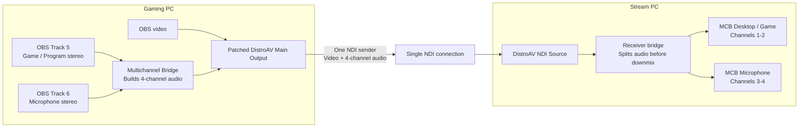

# Multichannel Bridge for DistroAV

> Experimental modified DistroAV build for two-PC OBS setups  
> Current version: **0.3.1-alpha**  
> Based on: **DistroAV 6.2.1**

Multichannel Bridge for DistroAV sends one OBS video output together with two independent stereo audio mixes through a single NDI® sender. On the receiving PC, those four audio channels are split back into separate OBS mixer sources before OBS downmixes them.

The current build is intended for a common two-PC layout:

- **OBS Track 5 → NDI channels 1–2:** game, desktop, Discord, alerts, or program audio
- **OBS Track 6 → NDI channels 3–4:** microphone

The stream PC receives one DistroAV NDI source for video, plus separate **MCB Desktop / Game** and **MCB Microphone** sources for independent mixing and recording.

> This is an independent, unofficial modification. It is not affiliated with or endorsed by the OBS Project, DistroAV project, or Vizrt NDI AB.

---

## Why this exists

Some long-running two-PC NDI workflows can develop gradual A/V drift or sudden sync jumps after a reconnect, game-capture rehook, buffer correction, or sender reset. Earlier troubleshooting included restarting NDI outputs, resetting sources, testing Frame Sync, monitoring timestamps and buffers, and experimenting with small audio-rate corrections in parts per million.

Those techniques can help diagnose or recover from a problem, but they do not remove the underlying complexity of running video/program audio and microphone audio through separate senders and receive paths.

This project takes a simpler approach: **video, game audio, and microphone audio all travel through the same DistroAV Main Output sender, connection, and timestamp timeline while remaining separately controllable on the stream PC.**

---

## How it works



### Sender

The bridge captures two OBS stereo tracks, pairs their audio blocks, and creates one four-channel audio frame:

```text
Channels 1–2 = Track 5
Channels 3–4 = Track 6
```

DistroAV continues to use its normal Main Output video path. The bridge only changes how multiple OBS audio tracks are packed into the existing sender.

### Receiver

The receiving DistroAV source sees the incoming four-channel audio before OBS converts it to the profile’s normal speaker layout. The bridge splits it into two standard OBS audio sources and suppresses the original combined audio to prevent duplication.

Audio and video are still separate NDI frame types, but they now share one sender identity, one connection, and one timing path instead of separate NDI senders.

---

## Current capabilities

- One normal DistroAV Main Output video stream
- Two configurable OBS stereo tracks carried as four NDI audio channels
- Separate game/program and microphone sources on the stream PC
- Independent stream and recording-track routing
- Bounded audio queues
- Silence fallback if one selected OBS track stops delivering callbacks
- Duplicate-audio suppression on the receiver
- Sender and receiver diagnostics
- One package for both PCs, with selectable Sender and Receiver roles
- Windows EXE installer with backup, duplicate cleanup, hash verification, upgrade support, and uninstall restoration

### Possible future expansion

OBS exposes six audio tracks, so the same design could theoretically support up to six stereo pairs, or twelve NDI audio channels. That is not implemented in the current alpha.

---

## Requirements

- Windows x64
- OBS Studio
- NDI 6 Runtime installed separately
- 48 kHz audio on both PCs
- A wired network suitable for the selected NDI resolution and frame rate

Known development environment:

- OBS Studio 32.1.2
- DistroAV 6.2.1 base
- NDI Runtime 6.3.2

Compatibility outside that environment is not guaranteed.

---

## Installation

Install the same build on both computers. The release artifact includes a normal Windows `.exe` installer and a portable ZIP fallback.

### Recommended EXE installation

1. Download `Multichannel-Bridge-for-DistroAV-Setup-v0.3.1-alpha.exe`.
2. Close OBS completely.
3. Run the installer as Administrator on the gaming PC and stream PC.
4. Select the root OBS folder, normally `C:\Program Files\obs-studio`.
5. The installer backs up the current DistroAV installation, removes the obsolete standalone bridge, disables duplicate ProgramData/AppData DistroAV copies, installs the modified build, verifies its hash, and adds a Windows uninstaller.
6. Start OBS and choose the correct role in **Docks → Multichannel Bridge for DistroAV**.

The installer is not Authenticode-signed unless the maintainer adds a code-signing certificate, so Windows may display an **Unknown publisher** warning. Verify the release SHA-256 checksum before running it.

### Portable fallback

The portable ZIP still contains the PowerShell and `.cmd` installers for debugging or manual deployment. Close OBS before using either method.

### Gaming PC

1. Open **Docks → Multichannel Bridge for DistroAV**.
2. Select **Gaming PC / Sender**.
3. Choose the two OBS tracks, normally Track 5 and Track 6.
4. Route game/program audio to Track 5 and microphone audio to Track 6 in **Advanced Audio Properties**.
5. Remove old separate NDI audio-only filters or sources.
6. Enable **DistroAV Main Output**.

### Stream PC

1. Open **Docks → Multichannel Bridge for DistroAV**.
2. Select **Stream PC / Receiver**.
3. Add one ordinary DistroAV NDI Source and select the Gaming PC feed.
4. Attach the bridge to that source.
5. Create or repair the split audio sources.
6. Confirm that **MCB Desktop / Game** and **MCB Microphone** appear separately in the mixer.
7. Keep original-audio suppression enabled to avoid duplicate audio.

---

## Frame Sync

For a single combined sender being received by one OBS instance, begin testing with **NDI Frame Sync disabled**.

Frame Sync can help when adapting multiple independent sources to a common local clock, but it may also retime or buffer audio and video. If periodic audio skips or sudden 100–300 ms jumps occur, compare a clean test with Frame Sync disabled before changing anything else.

Official background: [NDI frame synchronization documentation](https://docs.ndi.video/all/developing-with-ndi/advanced-sdk/ndi-sdk-review/video-formats/frame-synchronization)

---

## Healthy diagnostics

### Gaming PC

A healthy sender normally shows:

- `Sender active: yes`
- `Paired` continuously increasing
- `Discarded: 0`
- `Silence fallback: 0`
- queue depths returning to `0 / 0`

### Stream PC

A healthy receiver normally shows:

- `Receiver attached: yes`
- `Split outputs ready: yes`
- `Split outputs active: yes`
- `Detected channels: 4`
- `Missing program: 0`
- `Missing mic: 0`
- packet count continuously increasing

---

## Troubleshooting

### Audio skips or jumps

- Disable Frame Sync and restart the receiving OBS instance.
- Confirm there are no old separate NDI microphone or desktop-audio sources still active.
- Check whether `Discarded`, `Silence fallback`, `Missing program`, or `Missing mic` increased.
- Check both OBS logs for reconnects, buffer changes, capture-hook reattachment, or output restarts.

### Slow drift

- Confirm both PCs use 48 kHz audio.
- Measure the direction and rate over at least 30–60 minutes.
- Compare controlled tests with Frame Sync on and off.
- Avoid applying PPM correction until the drift is repeatable and the affected timing path is known.

### Duplicate DistroAV menus

Only one active DistroAV installation should remain. Common plugin locations include:

```text
C:\Program Files\obs-studio\obs-plugins\64bit\distroav.dll
C:\ProgramData\obs-studio\plugins\distroav\bin\64bit\distroav.dll
%APPDATA%\obs-studio\plugins\distroav\bin\64bit\distroav.dll
```

### Missing old multichannel plugin warning

Version 0.3.1 is integrated into `distroav.dll`. It does not use the old standalone `ndi-multichannel-bridge.dll`. Remove the obsolete module entry from OBS Plugin Manager if OBS still reports it as missing.

---

## Credits

This project is built on the work of the OBS and DistroAV communities.

### OBS Studio

[OBS Studio](https://obsproject.com/) provides the host application, audio mixer, plugin APIs, source/output framework, and recording/streaming platform used by this project.

- Website: [obsproject.com](https://obsproject.com/)
- Source: [github.com/obsproject/obs-studio](https://github.com/obsproject/obs-studio)
- Developer documentation: [obsproject.com/docs](https://obsproject.com/docs/)
- License: [GNU GPL version 2 or later](https://github.com/obsproject/obs-studio/blob/master/COPYING)
- Support the project: [obsproject.com/contribute](https://obsproject.com/contribute)

### DistroAV

[DistroAV](https://github.com/DistroAV/DistroAV), formerly OBS-NDI, provides the original NDI source, output, filters, runtime loading, configuration, and build systems modified by this project.

- Source: [github.com/DistroAV/DistroAV](https://github.com/DistroAV/DistroAV)
- Base release: [DistroAV 6.2.1](https://github.com/DistroAV/DistroAV/releases/tag/6.2.1)
- Issues: [github.com/DistroAV/DistroAV/issues](https://github.com/DistroAV/DistroAV/issues)
- License: [GNU GPL version 2 or later](https://github.com/DistroAV/DistroAV/blob/master/LICENSE)
- Support the project: [Open Collective](https://opencollective.com/distroav)

### NDI technology

NDI is a video and audio connectivity technology from Vizrt NDI AB.

- Website: [ndi.video](https://ndi.video/)
- Tools and Runtime: [ndi.video/tools](https://ndi.video/tools/)
- Documentation: [docs.ndi.video](https://docs.ndi.video/)
- Licensing and trademark guidance: [NDI licensing documentation](https://docs.ndi.video/all/developing-with-ndi/sdk/licensing)

NDI® is a registered trademark of Vizrt NDI AB.

---

## License and redistribution

This modified DistroAV build and the bridge additions are distributed under the **GNU General Public License, version 2 or, at your option, any later version** (`GPL-2.0-or-later`). See [`LICENSE`](LICENSE).

If you distribute a binary build, you should also:

- preserve OBS and DistroAV copyright and license notices;
- clearly identify that the build is modified;
- provide the complete corresponding source code and build/install scripts for that exact binary as required by the GPL;
- keep the derivative work under GPL-compatible terms;
- comply separately with any licenses covering bundled third-party components;
- avoid bundling the NDI Runtime or SDK unless you have confirmed that distribution is permitted under the applicable NDI terms.

This project is not affiliated with or endorsed by the OBS Project, DistroAV project, or Vizrt NDI AB. Do not send support requests for this modified build to upstream maintainers unless the problem has first been reproduced on an official unmodified release.

This software is provided **as is**, without warranty of any kind. Use it first in non-critical recordings and verify long-duration behavior before relying on it for a live production.

---

## Project status

**0.3.1-alpha is experimental.** It has been tested in a specific two-PC environment but has not undergone broad hardware, network, regression, security, or broadcast-certification testing.

Bridge additions and documentation:

```text
Copyright (C) 2026 Andrew Carriker and contributors
```

OBS Studio and DistroAV portions remain copyright their respective authors and contributors.
