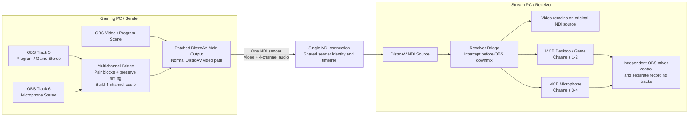

# Multichannel Bridge for DistroAV

> **Experimental alpha software for two-PC OBS workflows**  
> Current build/UI name: **NDI Multichannel Bridge 0.3.0-alpha**  
> Base: **DistroAV 6.2.1**

Multichannel Bridge for DistroAV is a custom, GPL-licensed modification of [DistroAV](https://github.com/DistroAV/DistroAV) that sends one OBS video output together with multiple independently mixable stereo audio buses through a single NDI® sender. The receiving PC separates those audio channel pairs back into ordinary OBS mixer sources before OBS can downmix them.

The current alpha carries two stereo buses—normally game/desktop audio and microphone—as four NDI audio channels beside the standard DistroAV Main Output video stream. The design is intended to reduce a class of two-PC A/V synchronization failures caused by running video/program audio and microphone audio through separate NDI senders, connections, receive buffers, and timing paths.

> **Important:** This is an independent experimental modification. It is **not** an official OBS Project, DistroAV, or Vizrt NDI AB release, and none of those organizations endorse or support it.

---

## Why this exists

Some long-running two-PC OBS/NDI workflows experience one or both of these symptoms:

- **Gradual drift:** audio slowly moves ahead of or behind video over a long recording or stream.
- **Sudden sync jumps:** audio abruptly skips, cuts, or changes offset after a source interruption, capture-hook reattachment, buffer correction, NDI reconnect, or sender/receiver reset.

Community reports of long-duration DistroAV/OBS-NDI audio delay exist—for example, [DistroAV issue #742](https://github.com/DistroAV/DistroAV/issues/742)—but this project does **not** claim that every DistroAV installation drifts or that every synchronization problem has the same cause.

Before this bridge was built, the troubleshooting path included:

- restarting or force-resetting NDI outputs after an apparent discontinuity;
- resetting sender and receiver sources to clear stale buffering state;
- testing NDI Frame Sync on and off;
- monitoring buffer age, timestamps, dropped frames, reconnects, and queue behavior;
- experimenting with small audio-rate corrections in parts per million (PPM) to counter slow clock-rate mismatch;
- running separate NDI audio-only senders for desktop/game and microphone audio.

Those methods can be useful diagnostically, but they primarily treat symptoms after timing has diverged. They also add more state, more correction logic, or more independent network paths.

The simpler approach used here is structural: **send video, game/program audio, and microphone audio through one DistroAV Main Output sender and one receive connection, while keeping the audio buses separately controllable on the stream PC.**

---

## How it works



### Sender side

The Gaming PC uses the regular DistroAV Main Output video path. The bridge captures two selected OBS stereo mixes, normally:

| OBS mix | NDI channel mapping | Typical use |
|---|---:|---|
| Track 5 | Channels 1–2 | Game, desktop, Discord, alerts, program mix |
| Track 6 | Channels 3–4 | Microphone |

The bridge:

1. receives raw stereo blocks from both selected OBS mixes;
2. holds them briefly in bounded FIFO queues;
3. accepts OBS’s normal one-block callback phase at 48 kHz;
4. pairs compatible blocks and constructs one four-channel planar float audio frame;
5. passes that frame into DistroAV’s existing NDI sender beside the normal video frames;
6. substitutes silence only when one selected mix genuinely stops producing callbacks long enough to require fallback.

At 48 kHz, a normal 1,024-sample audio block represents approximately **21.333 ms**. A stable sender commonly reports that value as the last timestamp delta.

### Receiver side

The Stream PC adds one ordinary DistroAV NDI Source for the combined feed. The receiver bridge intercepts the incoming raw four-channel audio inside DistroAV **before OBS remixes it to the profile’s stereo speaker layout**.

It then creates two standard OBS audio-only sources:

- **MCB Desktop / Game** — channels 1–2
- **MCB Microphone** — channels 3–4

The original DistroAV source continues to provide video. Once both split audio outputs are ready, the bridge can suppress the original combined audio packet to prevent duplicated or downmixed audio.

### What “tied to the video” means

Audio is not physically embedded inside each video frame. NDI still transports audio frames and video frames as distinct frame types. In this design, however, they share:

- one DistroAV sender object;
- one advertised NDI source;
- one sender/receiver connection;
- one associated sender timeline;
- one network and receive-buffering path.

This removes the independent sender and connection state that exists when microphone audio is transmitted as a separate NDI audio-only source.

---

## Current capabilities

- One normal DistroAV Main Output video stream—no second video encode or duplicate 4K frame-copy path.
- Two configurable OBS stereo tracks packed into one four-channel NDI audio stream.
- Independent game/program and microphone faders on the receiving OBS instance.
- Independent stream and recording-track routing after reception.
- Bounded sender queues to prevent unbounded latency growth.
- Silence fallback if one selected OBS mix stops delivering callbacks.
- Receiver-side channel splitting before OBS downmix.
- Automatic suppression of the original combined audio after split outputs are active.
- Sender and receiver status dock with counters, meters, queue depth, packet age, detected channel count, missing-channel counters, and diagnostics copy/reset controls.
- Role protection so the same package can be installed on both computers while the receiver role disables accidental Main Output loopback.

### Theoretical expansion

OBS exposes up to six audio mixes. The same architecture could theoretically map all six stereo mixes into twelve NDI audio channels:

```text
OBS Track 1 -> NDI channels 1-2
OBS Track 2 -> NDI channels 3-4
OBS Track 3 -> NDI channels 5-6
OBS Track 4 -> NDI channels 7-8
OBS Track 5 -> NDI channels 9-10
OBS Track 6 -> NDI channels 11-12
```

That expansion is **not implemented in v0.3.0-alpha**. It would require dynamic multi-track selection, additional pairing queues, per-bus fallback handling, and receiver proxy generation for each enabled stereo pair.

---

## Audio format and bandwidth

The current bridge sends four channels of 48 kHz, 32-bit floating-point audio:

```text
48,000 samples/sec × 4 channels × 32 bits = 6.144 Mbit/sec
```

Approximate payload rates before transport overhead:

- Four channels total: **6.144 Mbit/s**
- Each stereo pair: **3.072 Mbit/s**
- Each mono channel: **1.536 Mbit/s**

The audio payload is small compared with a high-bandwidth 4K NDI video stream.

---

## Requirements

Current alpha target:

- Windows x64
- OBS Studio compatible with DistroAV 6.2.1
- DistroAV 6.2.1 codebase, modified by this project
- NDI 6 Runtime installed separately
- 48 kHz OBS audio sample rate on both PCs
- A stable wired network appropriate for the selected NDI video format and resolution

Known test environment during development:

- OBS Studio 32.1.2
- DistroAV 6.2.1 base
- NDI Runtime 6.3.2
- Windows 11 x64

This is a test record, not a guarantee of compatibility with every system.

---

## Installation

> Future Windows releases should use the provided signed or clearly identified `.exe` installer. Manual copying is retained here only as a fallback for development builds.

Install the **same compiled package on both PCs**.

Before installation:

1. Close OBS completely.
2. Back up your OBS profile and scene collection.
3. Remove or disable obsolete standalone `ndi-multichannel-bridge.dll` builds from v0.2.x.
4. Make sure only one active `distroav.dll` exists across OBS plugin locations.
5. Install the NDI Runtime separately from the official NDI distribution if it is not already present.

### Gaming PC

1. Install the custom DistroAV build.
2. Open **Docks → NDI Multichannel Bridge**.
3. Select **Gaming PC / Sender**.
4. Select the two OBS audio tracks—defaults are Track 5 and Track 6.
5. Route program/game audio to Track 5 and microphone audio to Track 6 in **Advanced Audio Properties**.
6. Remove old DistroAV audio-only output filters that would create separate desktop or microphone NDI senders.
7. Enable **DistroAV Main Output** and choose a unique source name.

### Stream PC

1. Install the same custom DistroAV build.
2. Open **Docks → NDI Multichannel Bridge**.
3. Select **Stream PC / Receiver**.
4. Add one ordinary **DistroAV NDI Source** and select the Gaming PC’s combined feed.
5. In the bridge dock, attach to that OBS source.
6. Run **Create / repair split audio sources**.
7. Confirm that **MCB Desktop / Game** and **MCB Microphone** appear as separate mixer sources.
8. Enable suppression of the original combined audio to avoid duplication.
9. Route the two split sources to stream and recording tracks as desired.

---

## Frame Sync guidance

For a single combined sender being recorded or streamed by one receiving OBS instance, begin testing with **NDI Frame Sync disabled** on the receiver source.

Frame Sync can be useful when adapting multiple independent sources to a common local clock, but it may also retime audio and video. In systems where periodic 100–300 ms audio skips or jumps are heard, compare a clean test with Frame Sync disabled before changing anything else.

Disabling Frame Sync does not separate the four-channel audio from the sender. The audio and video still arrive from the same NDI source and retain their incoming timing relationship. A slow drift that appears only with Frame Sync disabled would indicate an additional clock, timestamp, buffering, reconnect, or implementation problem that should be measured rather than hidden with repeated resets.

Official background: [NDI frame synchronization documentation](https://docs.ndi.video/all/developing-with-ndi/advanced-sdk/ndi-sdk-review/video-formats/frame-synchronization).

---

## Healthy diagnostics

### Gaming PC / Sender

A healthy sender normally shows:

- `Sender active: yes`
- `Paired` continuously increasing
- `Discarded: 0` or nearly zero
- `Silence fallback: 0`
- `Last timestamp delta: 21.333 ms` at 48 kHz/1,024 samples
- queue depths returning to `0 / 0`
- low sender audio age

### Stream PC / Receiver

A healthy receiver normally shows:

- `Receiver attached: yes`
- `Split outputs ready: yes`
- `Split outputs active: yes`
- `Detected channels: 4`
- `Packets` continuously increasing
- suppressed-packet count increasing at approximately the same rate as packets
- `Missing program: 0`
- `Missing mic: 0`
- low receiver packet age

Receiver values are expected to remain inactive on the Gaming PC, and sender values are expected to remain inactive on the Stream PC.

---

## Troubleshooting A/V sync problems

### Periodic audio skip or sudden jump

1. Disable Frame Sync on the combined receiver source.
2. Restart OBS on the receiver to clear the old Frame Sync state.
3. Verify that `Missing program`, `Missing mic`, `Discarded`, and `Silence fallback` remain zero.
4. Check the OBS log for an NDI source reconnect, audio buffering increase, capture-hook reattachment, or output restart at the same time as the jump.
5. Confirm there are no old separate NDI microphone or desktop-audio sources still active.

### Slow drift over time

1. Measure the direction and rate of drift over at least 30–60 minutes.
2. Confirm both OBS instances are set to 48 kHz.
3. Confirm the bridge is preserving incoming timestamps and no fallback/discard counters are increasing.
4. Compare Frame Sync on versus off in separate controlled tests.
5. Record OBS logs from both PCs for the same test window.
6. Avoid applying PPM correction until the drift rate is repeatable and the underlying path is known; PPM adjustment can compensate clock mismatch but cannot repair sudden timestamp discontinuities.

### Large offset after game capture rehooks

A game-capture hook can disappear and return while the OBS audio engine continues uninterrupted. Because audio and video are still separate frame types, a capture discontinuity can still create a step change if OBS, DistroAV, NDI, or the receiving buffer does not re-establish the same timing relationship.

Capture logs from both PCs and look for:

- game-capture hook loss/reacquisition;
- video-frame interruption while audio packets continue;
- NDI sender or receiver restart;
- source reconnect;
- abrupt buffer growth or reset.

A forced reset may clear the symptom, but it should be treated as recovery—not as proof that the root cause is fixed.

### Encoding lag at 4K60

Do not install or enable the obsolete v0.2 standalone bridge output. That design requested a separate raw BGRA video output and copied 4K60 frames, which could overload OBS’s raw video-output path.

The v0.3 architecture modifies DistroAV Main Output in place and retains DistroAV’s normal video sender path.

### Duplicate DistroAV menus or `Duplicate library?` in the log

Search all OBS plugin locations for multiple `distroav.dll` files. Common paths include:

```text
C:\Program Files\obs-studio\obs-plugins\64bit\distroav.dll
C:\ProgramData\obs-studio\plugins\distroav\bin\64bit\distroav.dll
%APPDATA%\obs-studio\plugins\distroav\bin\64bit\distroav.dll
```

Only one active DistroAV DLL should remain.

### OBS reports the old multichannel plugin as missing

The v0.3 bridge is integrated into `distroav.dll`; it does not use the old standalone `ndi-multichannel-bridge.dll`. Remove the obsolete module entry from OBS Plugin Manager or refresh `%APPDATA%\obs-studio\plugin_manager\modules.json` after backing it up.

---

## What this project does not guarantee

This project reduces independent sender and receive paths; it does not make audio and video inseparable or eliminate every cause of synchronization failure.

It cannot guarantee protection from:

- network packet loss, congestion, or interface resets;
- NDI sender/receiver reconnects;
- OBS source or audio-engine restarts;
- game-capture hook loss and reacquisition;
- Frame Sync corrections;
- driver clock discontinuities;
- timestamp bugs in OBS, DistroAV, NDI, or this patch;
- recording muxer or playback-software timing problems.

Treat this as an experimental diagnostic and workflow improvement, not as a certified broadcast synchronization appliance.

---

## Building from source

The release source must contain the exact modified DistroAV source used to produce the binary, or otherwise satisfy the complete-source obligations of the GNU GPL.

Recommended release layout:

```text
README.md
LICENSE
CHANGE-NOTICE.md
THIRD-PARTY-NOTICES.md
LEGAL-COMPLIANCE-CHECKLIST.md
src/                         # complete patched DistroAV source tree
.github/workflows/           # build scripts
installer/                   # installer source and configuration
release/                     # binary packages and checksums
```

The current patch targets [DistroAV 6.2.1](https://github.com/DistroAV/DistroAV/releases/tag/6.2.1). A reproducible build should identify the exact upstream tag/commit, include all bridge source files and patch scripts, and produce checksums for released binaries.

---

## Credits and upstream projects

This project would not exist without the work of the OBS and DistroAV communities.

### OBS Studio

[OBS Studio](https://obsproject.com/) is free and open-source software for capturing, compositing, recording, encoding, and live streaming.

- Official website: [obsproject.com](https://obsproject.com/)
- Source code: [github.com/obsproject/obs-studio](https://github.com/obsproject/obs-studio)
- Developer/API documentation: [obsproject.com/docs](https://obsproject.com/docs/)
- User documentation and help: [obsproject.com/help](https://obsproject.com/help)
- License: [GNU GPL version 2 or later](https://github.com/obsproject/obs-studio/blob/master/COPYING)
- Support the OBS Project: [obsproject.com/contribute](https://obsproject.com/contribute)

Credit belongs to the OBS Project maintainers and contributors for the host application, audio mixer architecture, plugin APIs, frontend APIs, source/output framework, and the broader OBS ecosystem used by this modification.

### DistroAV

[DistroAV](https://github.com/DistroAV/DistroAV), formerly OBS-NDI, provides the NDI integration for OBS that this project modifies.

- Official source repository: [github.com/DistroAV/DistroAV](https://github.com/DistroAV/DistroAV)
- Base release used here: [DistroAV 6.2.1](https://github.com/DistroAV/DistroAV/releases/tag/6.2.1)
- Issue tracker: [github.com/DistroAV/DistroAV/issues](https://github.com/DistroAV/DistroAV/issues)
- License: [GNU GPL version 2 or later](https://github.com/DistroAV/DistroAV/blob/master/LICENSE)
- Project support: [Open Collective](https://opencollective.com/distroav)

Credit belongs to the DistroAV maintainers and contributors for the original NDI source, output, filter, runtime-loading, configuration, platform integration, and build systems. This bridge is a modified derivative of DistroAV—not a clean-room replacement.

### NDI technology

NDI is an IP video and audio connectivity technology from Vizrt NDI AB.

- Official website: [ndi.video](https://ndi.video/)
- NDI Tools and Runtime: [ndi.video/tools](https://ndi.video/tools/)
- Documentation: [docs.ndi.video](https://docs.ndi.video/)
- SDK licensing and trademark guidance: [NDI licensing documentation](https://docs.ndi.video/all/developing-with-ndi/sdk/licensing)

This project does not claim ownership of NDI technology, the NDI SDK, runtime, trademarks, or logos.

---

## License

This modified DistroAV build and the bridge additions are distributed under the **GNU General Public License, version 2 or, at your option, any later version** (`GPL-2.0-or-later`) to remain compatible with the upstream DistroAV codebase.

See [`LICENSE`](LICENSE) for the complete license text.

- **NDI® is a registered trademark of Vizrt NDI AB.**
- OBS, OBS Studio, Open Broadcaster Software, and the OBS Studio logo are trademarks or registered trademarks of their respective owner, including Wizards of OBS LLC as identified by the OBS Project.
- DistroAV and associated project names, logos, and marks belong to their respective owners.
- All other product names and trademarks are the property of their respective owners.

---

## No affiliation or endorsement

This project is independently developed and is not affiliated with, sponsored by, certified by, or endorsed by:

- the OBS Project;
- Wizards of OBS LLC;
- the DistroAV project or its maintainers;
- Vizrt NDI AB;
- NewTek, Vizrt, or any related entity.

Do not direct support requests for this modification to upstream OBS, DistroAV, or NDI maintainers unless the issue has first been reproduced on an unmodified official build and is appropriate for that upstream project.

---

## Warranty and limitation of liability

This software is provided **as is**, without warranty of any kind. To the maximum extent permitted by applicable law, the authors, contributors, OBS Project, DistroAV contributors, Vizrt NDI AB, and other upstream parties are not liable for data loss, lost recordings, lost revenue, missed broadcasts, synchronization errors, network disruption, hardware damage, or other direct or indirect damages arising from use of this experimental modification.

The full controlling warranty disclaimer is contained in the GNU GPL included with the project.

---

## Security and network notice

This bridge does not add encryption, authentication, or access control to NDI transport. Do not assume that media carried on an NDI network is confidential. Use trusted networks, appropriate segmentation, firewall rules, and official NDI security/access-management guidance for the deployment environment.

## Project status

**v0.3.0-alpha is experimental.** It has been built and tested in a specific two-PC environment, but it has not undergone broad hardware, network, regression, security, or broadcast-certification testing.

Use it first in non-critical recordings, retain backups of OBS configuration, and verify long-duration behavior before relying on it for a live production.

---

## Copyright

Bridge additions and project documentation:

```text
Copyright (C) 2026 Andrew Carriker
```

Upstream OBS Studio and DistroAV portions remain copyright their respective authors and contributors. See the upstream repositories, source-file notices, [`CHANGE-NOTICE.md`](CHANGE-NOTICE.md), and [`THIRD-PARTY-NOTICES.md`](THIRD-PARTY-NOTICES.md).
